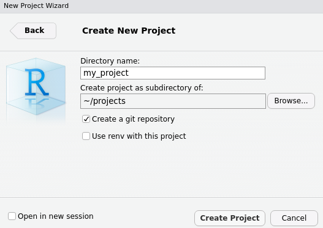
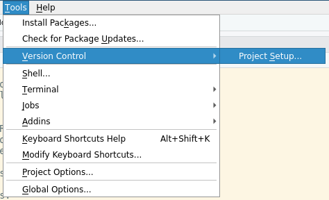
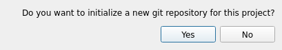
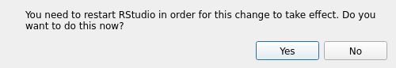
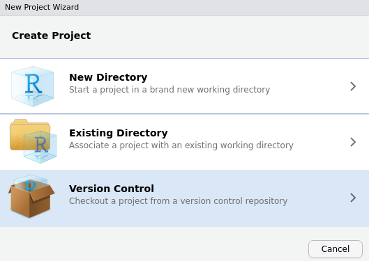
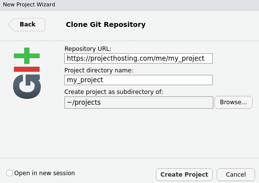
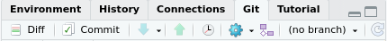
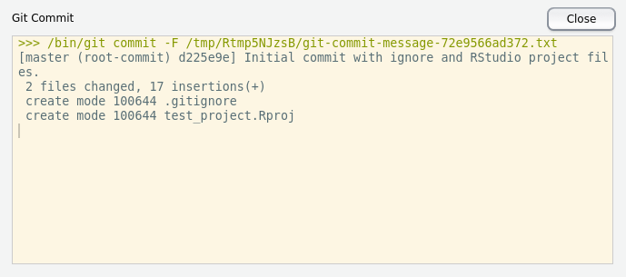
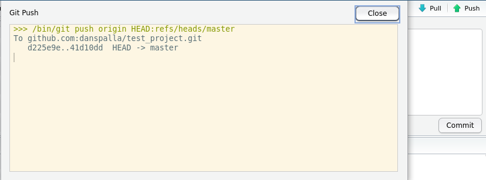

# Using Git in Rstudio {}

## Initializing a Repository For a New Project
If you haven't yet created a new project in RStudio, you can check the "Create a git repository" box in the new project wizard to automatically create one for you.

If you already have an existing project but wish to initialize a Git repository for it, its quite simple.

1. Select "Tools" from the toolbar, "Version Control", and click on "Project Setup..."

2. Select "Git" from the dropdown box

3. Confirm that you want to create a new Git repository

4. It may ask you to restart RStudio; restart RStudio

5. The Git tab will appear on the top-right window and show the status of your new repository

## Creating a Project From a Git Repository
Creating a new RStudio project from a Git repository, such as one hosted on GitHub, is quite simple.

1. Create a new project
2. Select "Version Control"

3. Select "Git"

4. Enter the repository URL, give the project a name, and select the directory where project files shall reside

## Making Changes and Committing
To make changes to files in a git repository, modify them you would any other file. When you are ready to commit your changes, do the following.

1. Hit the commit button under the Git tab and a new window will appear

2. Select, stage, the changed files that you wish to add and commit

3. Write a commit message that succinctly describes the "what" and "why" of your changes and hit the commit button. A status window will show whether or not it was successful

## Sharing Those Changes, Push
When you are ready to share your changes with the rest of the world, press the push button under the Git tab or on the commit window.

A status window will appear and show its success.

## Getting Changes From Others, Pull
To receive updates that others have pushed, hit the pull button under the Git tab.

A status window will appear and show its success.

## Viewing the Log
You can view the git log for a repository by clicking the history button.

You can click on each commit, read each commit changes, and see what files in the project were changed for that commit.

