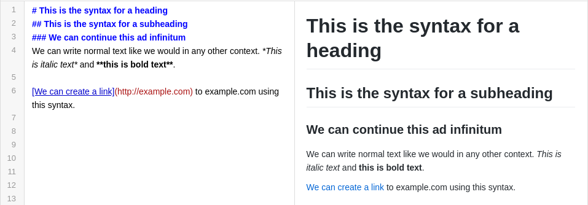
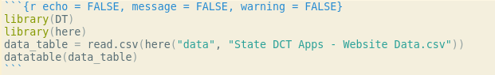
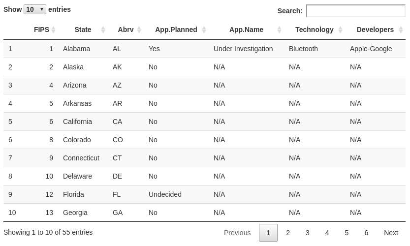

# RMarkdown Introduction {}

## What is Markdown?
Markdown is a markup language that enables a user to type a certain syntax and always generate the same output documents. There are no hidden characters or special formatting, that you would inevitably encounter using a word processor, which could cause unwanted changes to appearance of a document. Please see the, "Markdown Introductory Tutorial" in the appendix - [or click here](https://www.markdowntutorial.com/lesson/1/) - for a basic interactive tutorial. You can also see the, "Online Markdown Editor" link in the appendix - [or click here](https://markdown-editor.github.io/) - to experiment with Markdown editing in your web browser.

An example of Markdown text using the editor mentioned above is shown below.

## What is RMarkdown?
RMarkdown is an extension of the Markdown markup language that allows the user to embed R code in Markdown documents. A markup language is a simple set of syntax that when written will always produce the same output document (as opposed to WYSIWYG editors). RMarkdown extends this by embedding R code into the documents, showcasing the source code, a R script's output, and any figures generated by the R script.

Example of source code and output below.

## R Code in RMarkdown
There are two ways to include R code in an RMarkdown document. The first is to simply inline the code in the document itself and compile the document. The second way is to load the code from a file instead of inlining in the document. Loading the code from a file provides a nice separation between the data processing and data presentation of a R script. The second method should be used if the R code is lengthy, complicated, or needs to be worked on independent of successful RMarkdown document compilation.

To load a R script from a file, simply add "code = readlines("location_to_file")" and specify the path to the file.

You can also embed and run R code by typing it in the code block instead of listing the location to a file. The following code snippet uses R libraries "here" and "DT" to display a csv file as an interactive table.

The following is how the table is rendered when RMarkdown outputs the document as an HTML file.

