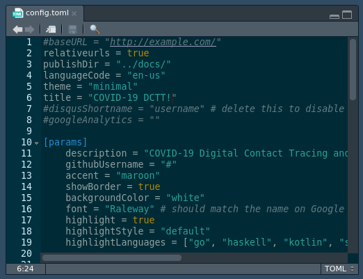
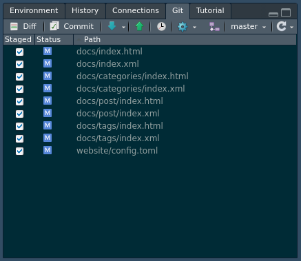
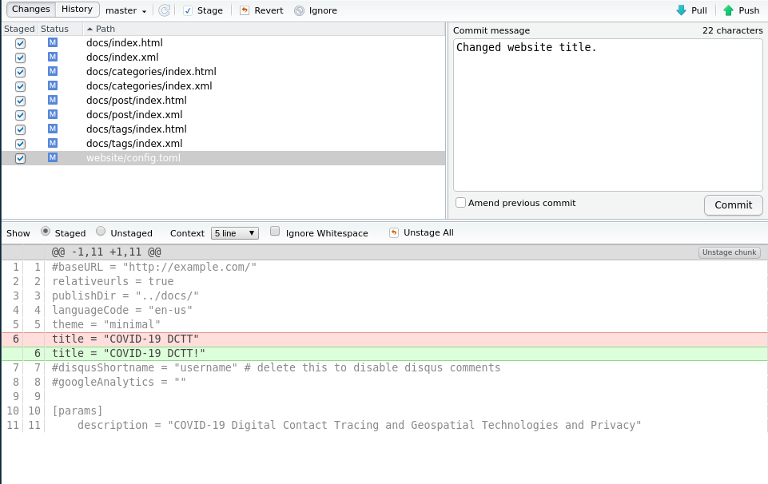
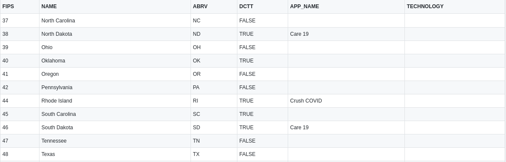
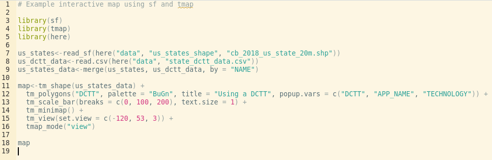
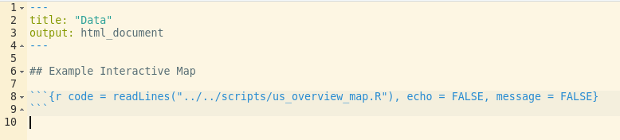
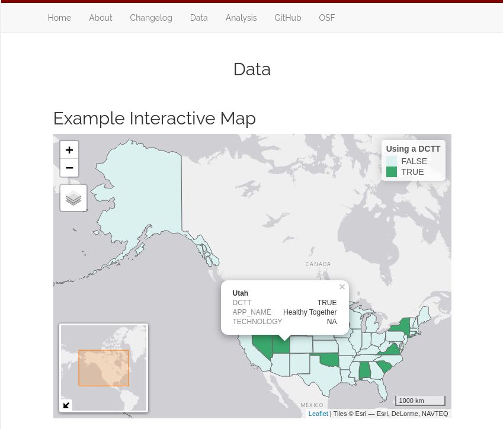
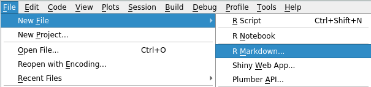
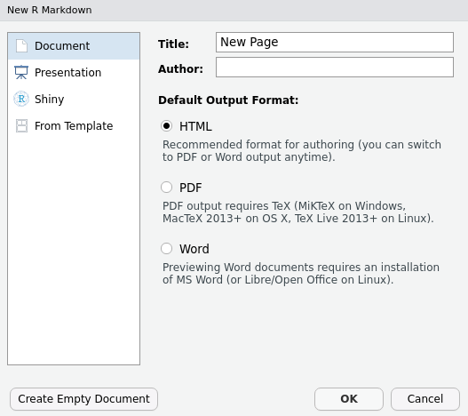
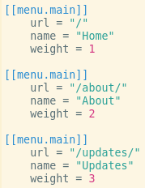

# Contribution to Project {}

## Project Repository
The project repository can be found at [GitHub](https://github.com/Peter-Kedron/COVID-19-Digital-Contact-Tracing-and-Geospatial-Technologies-and-Privacy). The repository provides the website, website source code, geodatabase, and helper scripts.

## Overview of Project Technologies
The project makes use of a number of technologies.

- R: used for scripts that help manage website content updates, interactive map, and analysis.
- RMarkdown: used to create website pages and embed R code
- RStudio: (optional), used to facilitate easy project contribution and management

## Repository Directory Hierarchy
The repository uses the following directory hierarchy:

- /website: Folder where the website source code is stored; new content for the website is created and added here.
- /docs: “Mount point” for GitHub pages; the project can be configured to serve the website from this folder (GitHub provides no flexibility on this), requiring no further intervention from team members.
- /data: Folder where any data files are stored for use in R scripts or RMarkdown files.
- /scripts: Folder where any R scripts, or other software scripts/tools, are stored. Ex: Helper scripts for building and local previewing of the website are stored here.

## How To Use The Helper Scripts
The following helper scripts are currently available for use in the "/scripts" directory.

- "project_install_dependencies.R": This script installs all the dependencies needed on the project. This should be used when the project has been pulled for the first time.
- "website_preview.R": This script will automatically build the website locally and launch a local web server that can be used to preview the site. This mode will continuously check website files for update and automatically rebuild the site so that changes can be easily previewed.
- "website_build.R": This script builds the website without providing a preview to the user.

## Getting Started With Contribution
To get started contributing to the project, use the following steps.

Using RStudio:

1. Open RStudio
2. Create a new project, select the version control option, select Git as the version control system, and enter the GitHub repository URL
3. Wait for RStudio to automatically pull the latest project files from GitHub
4. Navigate to the scripts folder and run the, "project_install_dependencies.R" script; this will install all dependencies and may take some time.

## Contribution Example 1
Scenario: Update the website title to better reflect the project.

1. Navigate to the "/website" directory
2. Open the, "config.toml" file
3. Change the line that says, 'title = "COVID-19 DCTT"' and change it to, 'title = "COVID-19 DCTT!"'; save the file

4. Navigate to the "/scripts" directory and run the, "website_preview.R" script to preview the website
5. Notice that there are changes in the "/website" directory and the "/docs" directory in the Git tab

6. Commit changes to your local repository stating the change

7. Push your changes to the GitHub repository to share the changes with the team.

## Contribution Example 2
Scenario: Create an interactive overview map for the US to show which states are using digital contact tracing and which states are not; include the technology used and application name if available.

1. Obtain the state data on DCTT, put the file in the "/data" directory

2. Place the shapefile that will be used in the "/data" folder as well
3. Write an R script to generate the interactive map and place it in the "/scripts" directory

4. Modify the RMarkdown document on the page we want to display the map, and add the location of the script

5. Run the "website_preview.R" from the "/scripts" directory to preview the map locally

6. Commit the changes to the "/data", "/scripts", "website", and "/docs" directories to your local repository
7. Push the changes to the GitHub repository to update the website and share the interactive map with the team

## Creating a New Page
Creating a new page for the website requires a number of changes across the website source files.

1. Create a new RMarkdown file from the "File -> New File" menu.

2. Give the file an appropriate title and make sure HTML is the output format

3. Save the file in the content directory: "/website/content/"

4. Open the "config.toml" configuration file located in "/website/"

5. Add the following entry to the configuration file to add the page to the navigation bar 

>[[menu.main]]
>
>>    url = "/page_file_name/"
>>
>>    name = "Pretty Page Name"
>>
>>    weight = 5

+ Note: The "url" should match the RMarkdown file name exactly, the "name" will be the name that appears on the website, and the weight (relative to other pages) will specify the order that the page will appear on the navigation bar

6. Run the "website_preview.R" script to build and preview the changes

## Creating a New Update Post
Detail how to create a new update post here.

