# Install Guide {-}

All of these components are needed to work on the project website, use the project helper scripts, and generate the interactive map.

## Installing Git on Windows {-}

Installing Git on Windows first requires you to download the installer at [https://git-scm.com/downloads](https://git-scm.com/downloads). Download and run the installer.

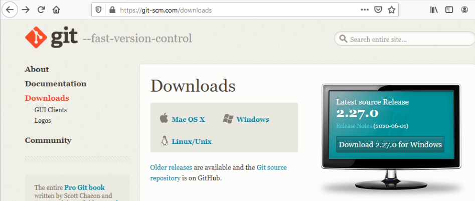

The Git installer for Windows is unnecessarily long and new users should continually click next through the options, leaving the defaults, until they finally reach the install button. This process is showcased below.

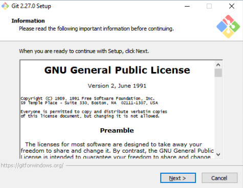

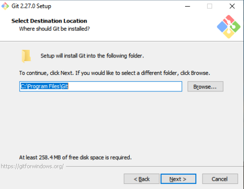

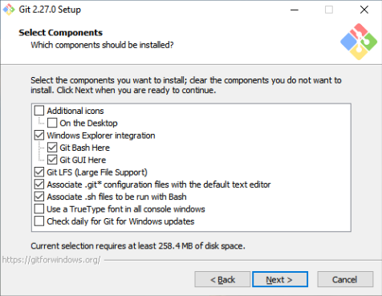

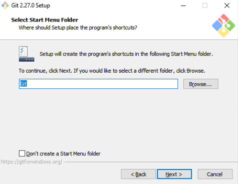

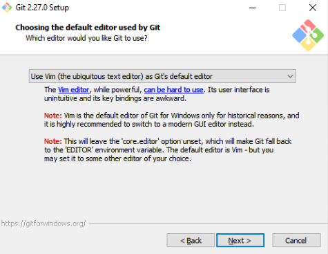

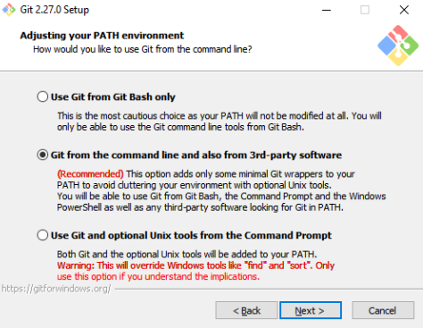

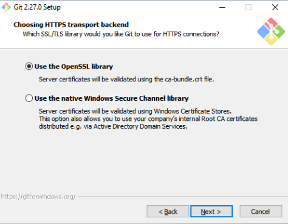

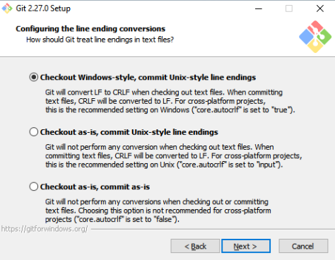

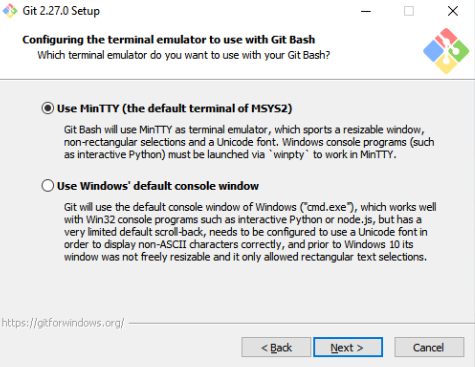

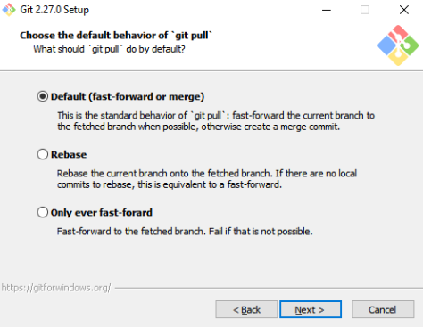

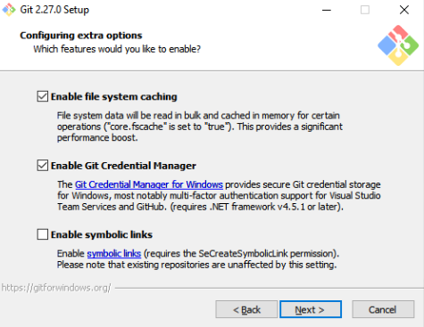

Finally, the install button will appear and you should click it as soon as possible to end this elongated installation experience.

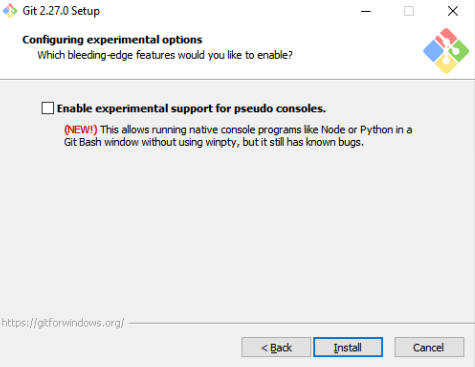

Git for Windows will then finally install.

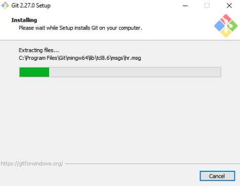

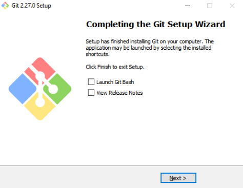

Click the next button to exit the installer.

## Installing R on Windows {-}

Go to [https://cran.r-project.org/](https://cran.r-project.org/) in your web browser to download the R installer. Then select, "Download for Windows" (or your operating system).

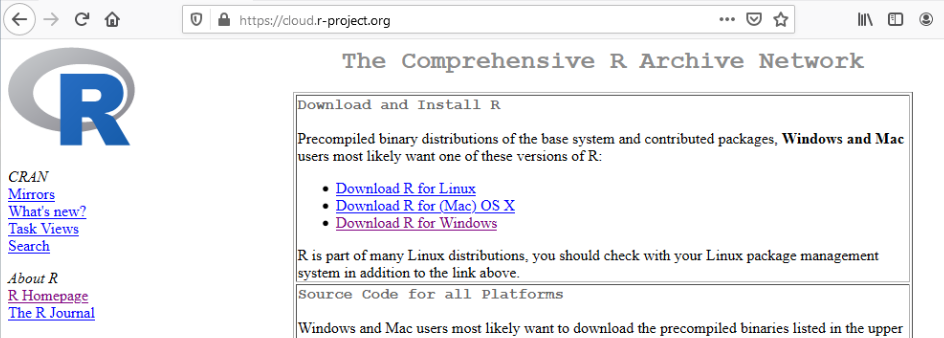

Then select, "base" to download the base R installer.

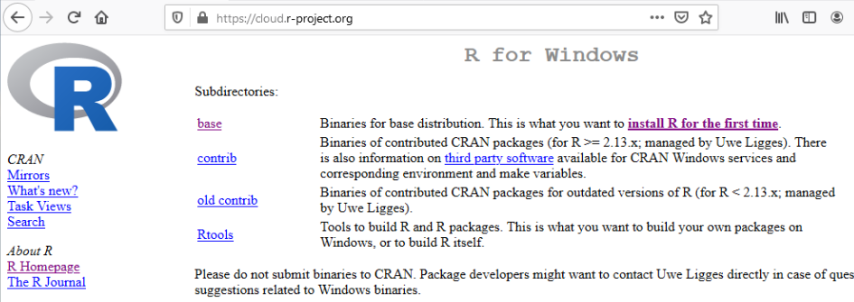

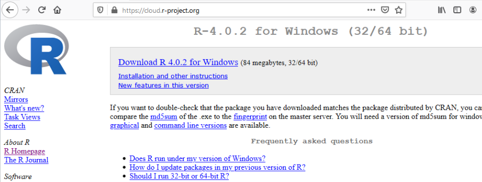

Then finally download the installer for Windows. When you open the installer, select, "English" or your language of choice.

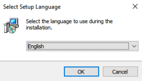

Accept the default options and continually click next on the installer.

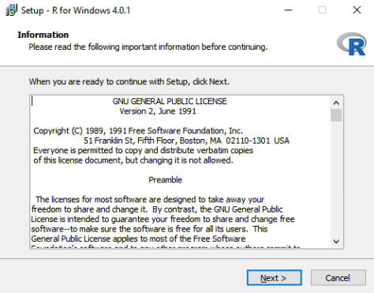

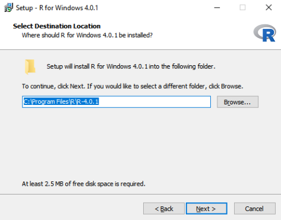

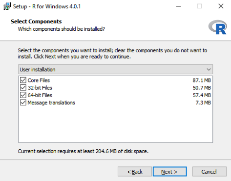

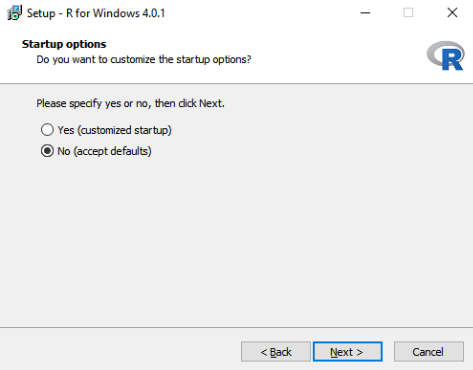

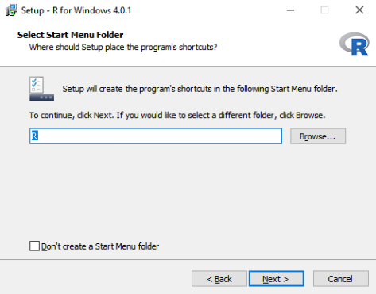

Clicking next will actually install R for Windows.

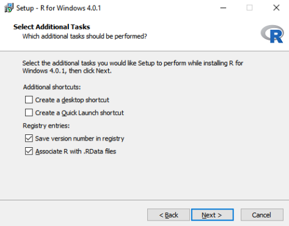

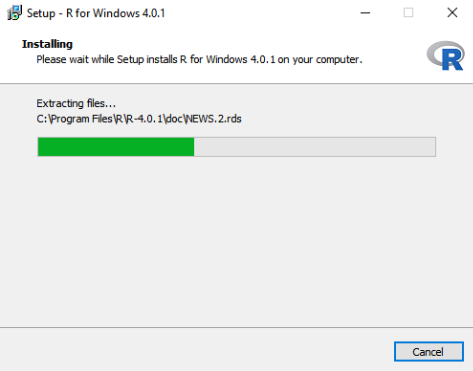

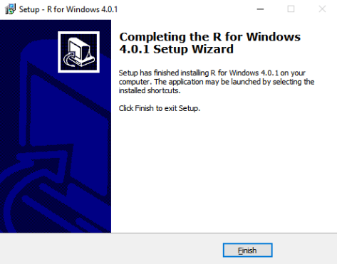

Click, "Finish" to end the installer.

## Installing RStudio on Windows {-}

Go to [https://rstudio.com/products/rstudio/download/#download](https://rstudio.com/products/rstudio/download/#download) in your web browser. Click the large download button or select the operating system you want to install for.

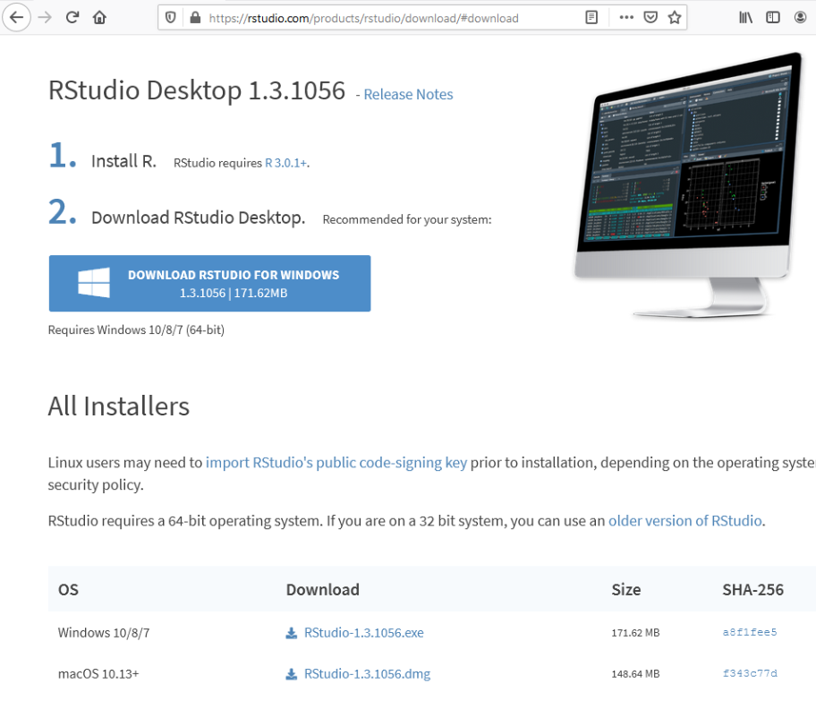

Continually click next until your reach the install button.

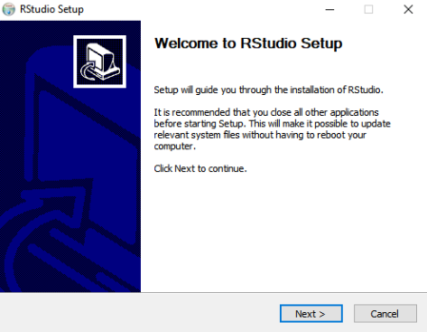

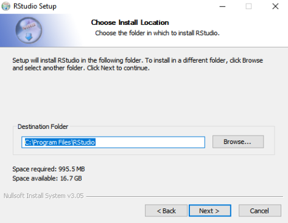

Then install RStudio.

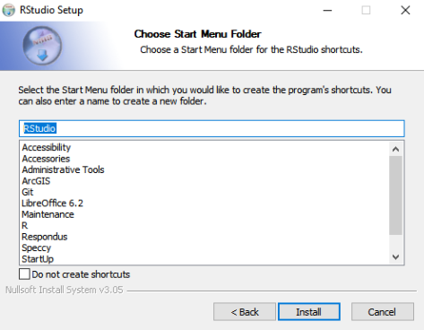

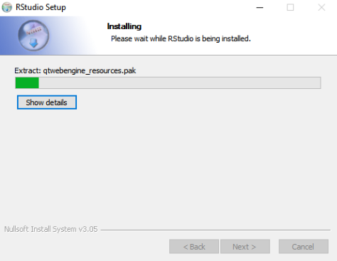

Click, "Finish" to end the installer.

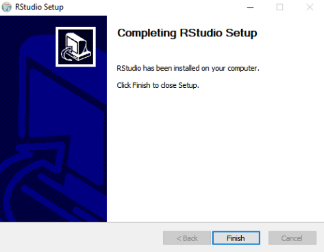

